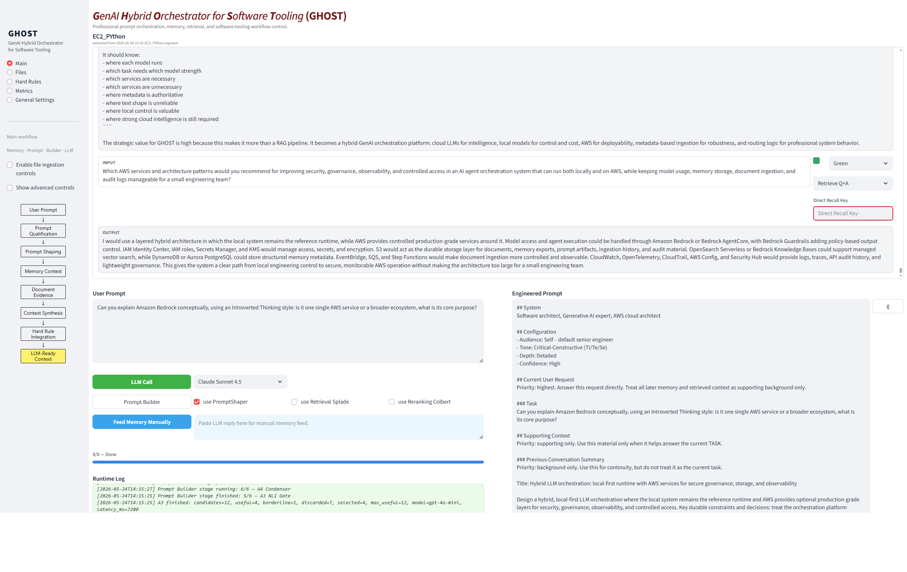
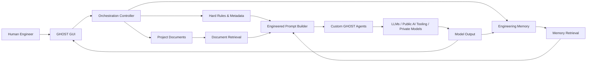
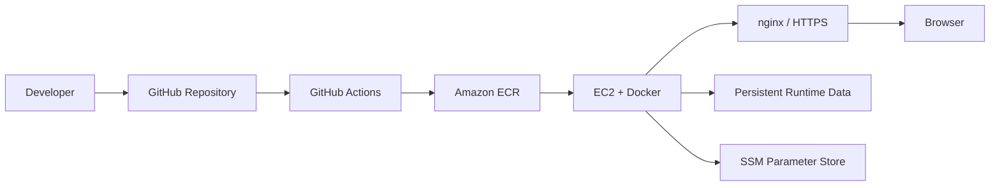

# GHOST — GenAI Hybrid Orchestrator for Software Tooling

GHOST is a human-controlled AI orchestration platform for software engineering. It combines deterministic and heuristic context-engineering methods with LLM-based agents, project retrieval, reusable memory, and external AI tooling in one controlled workflow.

The goal of GHOST is to make AI-assisted engineering work more reliable, inspectable, and reusable. It reduces context drift, makes AI-assisted work traceable, preserves reusable engineering memory, supports long-running requirements/architecture/code work, and keeps the human engineer in control of what context is selected, shared, sent, stored, or excluded.

## Motivation

Modern AI platforms such as ChatGPT UI, Codex, Copilot, Claude, and similar systems provide increasingly powerful tooling capabilities. They can support coding, repository interaction, deep research, online search, reasoning, document analysis, and other advanced model-side workflows. These capabilities are valuable and should be used where they are strong.

At the same time, long-running software-engineering work needs a level of control that public AI interfaces do not always expose. Memory can become unstable, large project context can become confusing, retrieval is often hidden, and the user has limited deterministic control over what is selected, remembered, ignored, synchronized, or sent to a model.

GHOST was created to address this gap. It is not designed to replace public AI platforms, but to act as a controllable engineering layer around them. Public platforms can provide advanced tooling capabilities; GHOST complements them with project-specific orchestration, structured memory, controlled retrieval, hard rules, metadata, auditability, and customizable specialist agents.

This allows GHOST to support capabilities that are difficult to control inside a closed interface: security and governance checks, continuous memory-brief generation, requirement–architecture–code synchronization, hard-rule enforcement, source-aware context selection, and project-specific prompt construction.

GHOST is designed for engineering work where context quality, continuity, and control matter. It allows the user to benefit from powerful external AI systems while keeping the surrounding workflow, memory, rules, retrieval logic, and synchronization under explicit engineering control.

## Visual Overview

<p align="center">
  
  <br/>
  <em>GHOST main workflow: prompt orchestration, memory handling, engineered prompt generation, model selection, and runtime logging.</em>
</p>

## What GHOST Enables

GHOST enables AI-assisted software work to become a governed engineering workflow rather than a sequence of disconnected model interactions. Requirements, architecture notes, code-related context, engineering memory, project documents, and model outputs can be connected through one controlled orchestration layer.

The system combines two complementary strengths. Deterministic software components handle the parts that should remain controlled and repeatable. LLM-based agents support interpretation, classification, condensation, reasoning, and language generation. Public AI platforms can still be used for their advanced tooling capabilities, while GHOST provides the surrounding control layer and customizable project-specific agents.

## Future Vision: Ghost2

Ghost2 extends GHOST into a human-mediated multi-brain orchestration environment.

The core idea is to connect several private specialist AI contexts through one shared GHOST board and shared memory layer. Each specialist brain can keep its own private chat history, documents, instructions, tools, and character. The user can work with these brains separately, then bring selected knowledge back into the Ghost2 shared board.

Ghost2 follows a blackboard-style concept: private specialist contexts remain separate, while selected knowledge can be synchronized into a shared working memory. Other brains can then use that shared context when a new engineered prompt is prepared for them.

A further Ghost2 direction is deterministic traceability across requirements, architecture, code, and tests. Stable IDs can connect related engineering artifacts, while a lightweight SQLite-based traceability index can act as a practical knowledge graph: showing which requirement is refined by which architecture decision, implemented by which code section, and verified by which test. This gives future agents a precise way to fetch and compare connected artifacts before using an LLM for contradiction checks, redesign impact analysis, or synchronization support.

The he moderator.uman remains th The user decides which brain is addressed, which private output is shared, which memory is reused, and which context is sent back into a private AI environment.

The intended result is stronger collective understanding across specialized AI contexts: each private brain keeps its own specialist continuity, while Ghost2 provides the shared memory, traceability, and orchestration layer that allows these separate contexts to support each other.

---

## Architecture

GHOST is organized as a modular orchestration system. The main workflow connects user input, project knowledge, memory, deterministic control logic, LLM-based agents, and optional external AI tooling into one inspectable engineering process.



The architecture is built around a clear separation of responsibilities:

- document ingestion and retrieval,
- memory recording and retrieval,
- prompt shaping and context construction,
- customizable agents,
- hard-rule handling,
- logging and observability,
- deployment and runtime persistence.

---

## Core System Capabilities

### Project Knowledge and Document Retrieval

GHOST can work with project documents such as requirements, architecture notes, technical documentation, design discussions, and code-related material.

The document retrieval layer supports project-based ingestion, embeddings, SPLADE-based sparse retrieval, reranking, relevance filtering, and context condensation. Its purpose is to make project knowledge available to the model in a controlled and inspectable way.

Relevant areas:

- `ragstream/ingestion/`
- `ragstream/retrieval/`
- `data/doc_raw/`
- `data/chroma_db/`
- `data/splade_db/`

### Engineering Memory

GHOST includes a structured memory layer for reusable engineering knowledge. Memory records can preserve important questions, answers, decisions, project context, tags, retrieval metadata, and later compressed memory briefs.

The memory direction includes episodic retrieval, semantic chunk retrieval, ActiveBrief generation, memory condensation, and controlled reuse of previous engineering context.

Relevant areas:

- `ragstream/memory/`
- `data/memory/`
- `.ragmem`
- `.ragmeta.json`
- `memory_index.sqlite3`

### Custom Agent Layer

GHOST uses configurable agents for tasks where interpretation, classification, checking, summarization, or synchronization are useful.

The public README describes agents by their role rather than internal stage names.

| Agent / Capability | Purpose |
|---|---|
| Prompt Understanding Agent | Classifies whether a prompt is strong or weak, on-topic, related, or irrelevant to the current memory context. |
| Prompt Shaping Agent | Structures the user request into useful fields such as task, purpose, tone, depth, audience, and confidence. |
| Evidence Relevance Gate | Checks whether retrieved document or memory context is actually useful for the current question. |
| Document Context Condenser | Summarizes selected document chunks into coherent context for the engineered prompt. |
| Memory Context Condenser | Summarizes selected memory episodes and semantic memory chunks into compact reusable context. |
| Continuous Memory Brief Agent | Maintains a compact running brief of the active engineering discussion. |
| GitHub Synchronization Agent | Uses repository changes and LLM reasoning to compare requirements, architecture, code, and tests for possible inconsistencies. |
| Security and Governance Guard | Supports controlled checking of sensitive context, prompt content, rules, and model-bound information. |
| Tool and Model Routing Layer | Supports deciding whether work should go through direct model calls, public AI tooling, private models, or repository-aware tools. |

Relevant areas:

- `ragstream/agents/`
- `ragstream/orchestration/`
- `data/agents/`
- `ragstream/preprocessing/`

### Rules, Logging, Metrics, and Observability

GHOST is designed so that important context and system behavior can be inspected rather than hidden inside model calls.

The platform supports hard-rule packages, structured logging, developer diagnostics, runtime logs, and a metrics/observability direction for tracking model usage, retrieval behavior, memory behavior, latency, and system decisions.

Relevant areas:

- `ragstream/textforge/`
- `ragstream/app/ui_metrics.py`
- `ragstream/app/ui_settings.py`
- `ragstream/config/`

---

## AWS Deployment and CI/CD

GHOST can run locally during development and can also be deployed on AWS through a containerized CI/CD path.

The current deployment architecture uses GitHub Actions, Amazon ECR, EC2, Docker, nginx, HTTPS, Route 53, SSM Parameter Store, and persistent runtime data outside the Docker image.



This deployment path keeps application code, runtime data, secrets, and public access separated in a manageable way for a small engineering setup.

Relevant areas:

- `.github/workflows/`
- `Dockerfile`
- `RAGstream_AWS_Deployment_Guide_v02.md`
- `data/`

---

## Repository Structure

A shortened view of the main implementation areas:

```text
ragstream/
  agents/             # GHOST agent modules
  app/                # Streamlit GUI, controller, UI actions
  config/             # Runtime configuration and prompt schema
  ingestion/          # Document loading, chunking, embeddings, vector stores
  memory/             # Memory recording, ingestion, retrieval, compression
  orchestration/      # SuperPrompt, AgentFactory, AgentPrompt, LLM client
  preprocessing/      # Prompt preprocessing and relation classification
  retrieval/          # Document and memory retrieval
  textforge/          # Logging and sink infrastructure

data/
  agents/             # JSON-based agent definitions
  doc_raw/            # Project documents
  chroma_db/          # Dense document vector stores
  splade_db/          # Sparse document retrieval stores
  memory/             # Memory files, metadata, SQLite, memory vectors

doc/
  01-Requirements/
  02-Architucture/
  03-Projekt_Status/
  04-GUI/
```

Some internal folder and document names still reflect the earlier project name RAGstream. The current project identity is GHOST.

---

## Documentation

The repository contains supporting documentation for requirements, architecture, UML diagrams, memory design, AWS deployment, and implementation status.

Important documentation areas include:

- requirements documents,
- architecture documents,
- UML diagrams,
- AWS deployment guide,
- implementation status snapshots,
- GUI screenshots and design material.

These documents provide the deeper technical detail behind the shorter public README.

---

## License & Author

This is a personal research and engineering project by **Rusbeh Abtahi**.

The codebase is MIT-licensed.

GHOST is developed as a serious, inspectable AI engineering platform for controlled GenAI orchestration, software-development support, reusable engineering memory, and future multi-brain collaboration.
